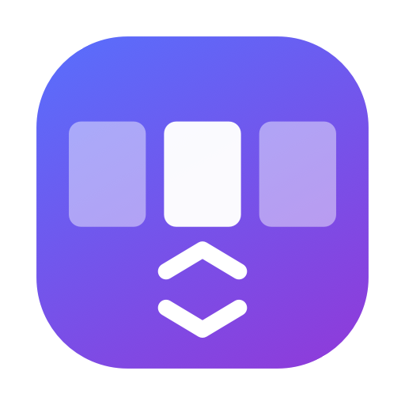

# Mac Space Switcher

**Switch macOS Spaces with your mouse wheel.** 
Just scroll over the clock in the menu bar.

[Install](#install) · [Setup](#setup-required-once) · [Configuration](#configuration) · [Troubleshooting](#troubleshooting)

---

Trackpad users can swipe between Spaces (desktops). With a regular mouse there is no easy equivalent.
**Mac Space Switcher** is a tiny menu bar app that turns the wheel into a Space switcher: put the pointer
over the clock in the top-right corner and scroll.

## Features

| | |
|---|---|
| 🖱️ **Scroll to switch** | Wheel up → previous Space, wheel down → next Space |
| 🖥️ **Multi-display** | Works on the top-right corner of every connected display |
| 🫥 **Stays out of the way** | Menu bar icon only — no Dock icon, no window |
| 🚀 **Start at Login** | Optional toggle in the menu bar menu |
| 🔒 **No hacks** | No private APIs, no SIP changes — it uses the system's own shortcuts |

## How it works

A global event tap watches scroll-wheel events. When the pointer is inside the hot zone
(the right-most 220 pt of the menu bar), the scroll event is swallowed and the app posts the
system's own **Ctrl + ← / Ctrl + →** shortcut, which macOS uses to move between Spaces.

## Requirements

- macOS 26.1 or later (the project's deployment target; lower it in Xcode to support older versions — `MenuBarExtra` needs macOS 13+)
- Xcode to build from source
- **Mission Control keyboard shortcuts enabled** (see below)

## Install

> **No prebuilt download.** The app isn't notarized by Apple, so a downloaded `.app` would be blocked by
> Gatekeeper. You need to build and archive it yourself — it takes a couple of minutes.

1. Clone the repo and open `mac-space-switcher.xcodeproj` in Xcode.
2. Select the `mac-space-switcher` target → **Signing & Capabilities**, and choose your own Team
   (a free Apple ID "Personal Team" is enough). Change the Bundle Identifier if Xcode says it's taken.
   Make sure **App Sandbox** is *not* enabled.
3. **Product → Archive**, then in the Organizer choose **Distribute App → Custom → Copy App**
   and save the app.
4. Move the resulting `mac-space-switcher.app` to `/Applications` and launch it from there.

## Setup (required, once)

1. **Enable the shortcuts** — System Settings → Keyboard → Keyboard Shortcuts → **Mission Control**,
   and turn on **Move left a space** and **Move right a space** (Ctrl + ← / →).
2. **Grant Accessibility** — on first launch macOS asks for permission. Go to
   System Settings → Privacy & Security → **Accessibility** and switch **mac-space-switcher** on.
   If macOS also asks for **Input Monitoring**, allow it.
3. Quit the app from its menu bar icon and launch it again.

Now scroll over the clock.

## Configuration

Tweak the constants at the top of `mac-space-switcher/SpaceSwitcher.swift`:

| Constant          | Default | Meaning                                          |
| ----------------- | ------- | ------------------------------------------------ |
| `zoneWidth`       | `220`   | Width (pt) of the hot zone from the right edge   |
| `zoneHeight`      | `40`    | Height (pt) of the hot zone from the top edge    |
| `scrollThreshold` | `3`     | Scroll amount needed for one switch              |
| `cooldown`        | `0.35`  | Minimum seconds between switches                 |
| `invertDirection` | `false` | Flip scroll direction                            |

## Troubleshooting

- **Nothing happens** — check `~/mac-space-switcher.log`. If it says *NOT trusted*, the Accessibility
  permission is missing or stale. Remove the app from the Accessibility list, run
  `tccutil reset Accessibility com.ostordev.mac-space-switcher`, launch again and re-grant.
- **Permission keeps disappearing after rebuilds** — unsigned/ad-hoc builds get a new identity each time.
  Sign with a real team in Xcode.
- **Spaces don't change but scrolling is captured** — the Mission Control shortcuts are disabled.
- **Won't work in the App Sandbox / Mac App Store** — global event taps are not allowed in the sandbox.

---

## License

No license chosen yet — add a `LICENSE` file (e.g. MIT) before publishing if you want others to reuse it.
